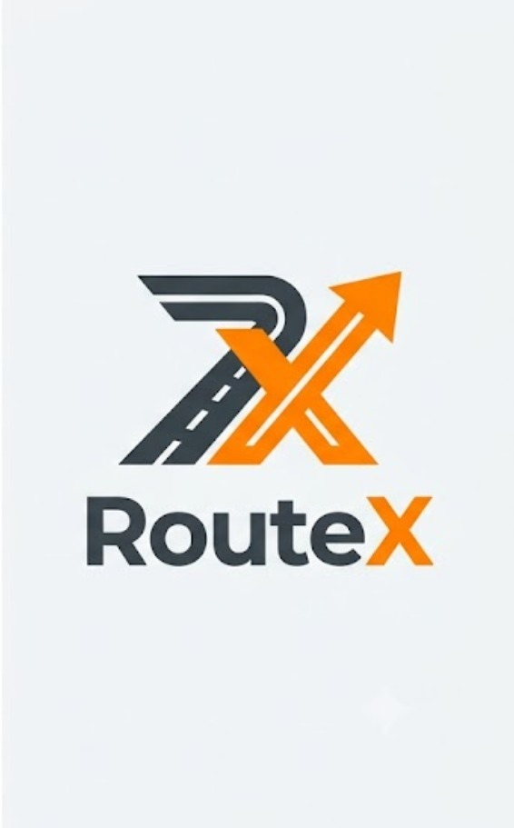
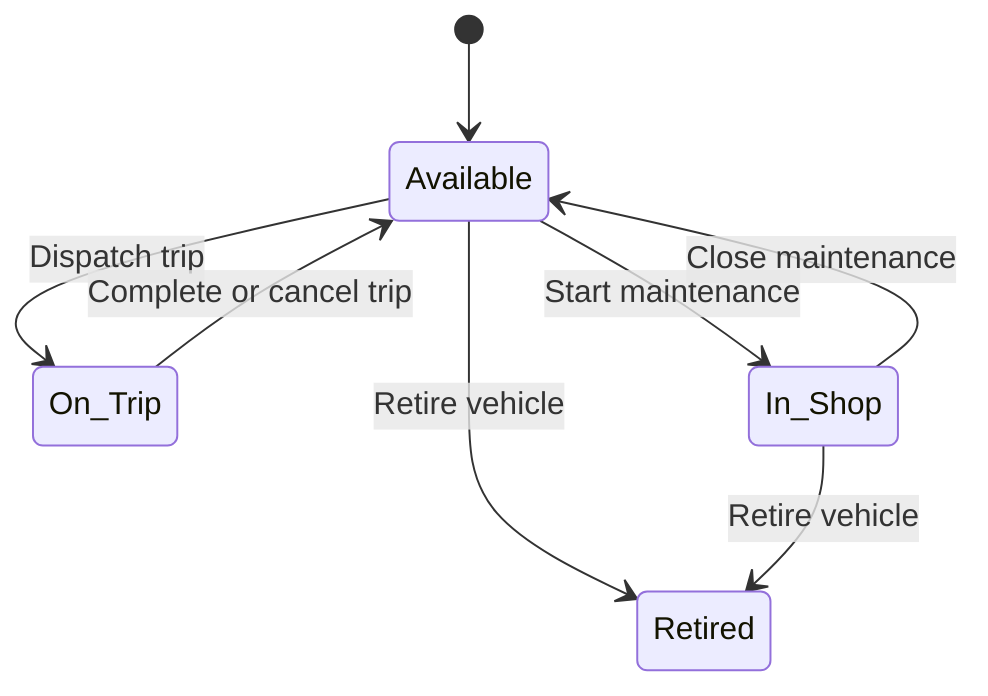
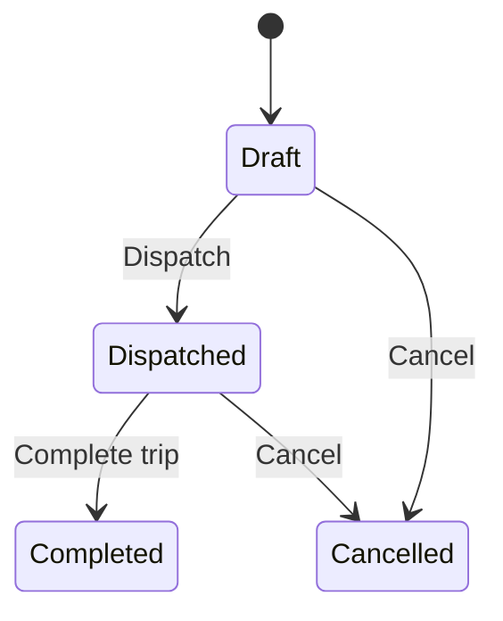

<p align="center">
  
</p>

# RouteX - Smart Transport Operations Platform

> A centralized transport operations platform for managing vehicles, drivers, trips, maintenance, fuel, expenses, and fleet performance.

Built for the **Odoo Hackathon (8 hours)**.

## Problem statement

Transport companies often manage fleets through spreadsheets and logbooks. This makes it easy to miss maintenance, assign unavailable drivers or vehicles, exceed load limits, lose track of fuel costs, and make decisions without clear operational data.

**RouteX** replaces these disconnected manual processes with one simple platform for fleet managers, drivers, safety officers, and financial analysts.

## Key features

- Secure email/password authentication
- Role-based access control (RBAC)
- Fleet dashboard with live operational KPIs
- Vehicle registry with search, filters, and status tracking
- Driver management with licence-expiry checks and safety scores
- Trip creation, dispatch, completion, and cancellation workflow
- Automatic vehicle and driver status updates
- Maintenance workflow that removes vehicles from dispatch availability
- Fuel logs and expense tracking
- Analytics for fuel efficiency, utilization, costs, and ROI
- CSV and PDF report export
- Responsive, beginner-friendly interface

## Roles

| Role | Main responsibilities |
| --- | --- |
| Fleet Manager | Manages vehicles, maintenance, trips, and fleet efficiency. |
| Driver | Creates or views assigned trips and completes trip details. |
| Safety Officer | Manages driver records, licence validity, and safety scores. |
| Financial Analyst | Reviews fuel, maintenance, expenses, costs, and ROI. |

## Beginner-friendly tech stack

| Area | Technology | Why we chose it |
| --- | --- | --- |
| Front end | React + Vite | Fast to start, simple component-based UI. |
| Styling | Tailwind CSS | Build a clean responsive interface without writing much CSS. |
| Authentication | Firebase Authentication | Ready-made secure email/password login. |
| Database | Cloud Firestore | Cloud database with no custom server to deploy during the hackathon. |
| Charts | Chart.js + react-chartjs-2 | Easy KPI charts and visual reports. |
| Icons | Lucide React | Simple, consistent icons. |
| CSV export | Papa Parse | Converts report data into downloadable CSV files. |
| PDF export | jsPDF + AutoTable | Creates printable report PDFs in the browser. |
| Deployment | Vercel or Firebase Hosting | Free and quick deployment. |

## Core business rules

RouteX enforces these rules in the application before a trip is dispatched:

1. Vehicle registration number must be unique.
2. Retired and **In Shop** vehicles cannot be selected for a trip.
3. A driver with an expired licence or **Suspended** status cannot be assigned.
4. A vehicle or driver already **On Trip** cannot be assigned again.
5. Cargo weight must not be greater than the vehicle's maximum load capacity.
6. Dispatching a trip changes both selected vehicle and driver to **On Trip**.
7. Completing a trip changes both vehicle and driver back to **Available**.
8. Cancelling a dispatched trip also restores both to **Available**.
9. Starting active maintenance changes the vehicle to **In Shop**.
10. Closing maintenance restores the vehicle to **Available**, unless it is retired.

## Status flows





## Dashboard KPIs

- Active vehicles
- Available vehicles
- Vehicles in maintenance
- Active trips
- Pending trips
- Drivers on duty
- Fleet utilization (%)
- Fuel efficiency (distance / fuel used)
- Operational cost (fuel + maintenance)
- Vehicle ROI

**Fleet utilization** = `(vehicles on trip / total non-retired vehicles) x 100`

**Fuel efficiency** = `distance travelled / fuel consumed`

**Vehicle ROI** = `(revenue - (maintenance cost + fuel cost)) / acquisition cost`

## Data model

| Collection | Important fields |
| --- | --- |
| `users` | name, email, role |
| `vehicles` | registrationNumber, name, type, maxLoadCapacity, odometer, acquisitionCost, status, region |
| `drivers` | name, licenceNumber, licenceCategory, licenceExpiryDate, phone, safetyScore, status |
| `trips` | source, destination, vehicleId, driverId, cargoWeight, plannedDistance, actualDistance, revenue, status |
| `maintenanceLogs` | vehicleId, description, cost, startDate, endDate, status |
| `fuelLogs` | vehicleId, tripId, litres, cost, date, odometer |
| `expenses` | vehicleId, tripId, category, amount, date, notes |

## Suggested project structure

```text
src/
  components/        # Reusable UI: tables, cards, forms, charts
  pages/             # Dashboard, Vehicles, Drivers, Trips, Maintenance, Reports
  services/          # Firebase and database functions
  utils/             # Validations, calculations, exports
  context/           # Authentication and user role state
  data/              # Demo data (optional)
  App.jsx
  main.jsx
```

## Getting started

### Prerequisites

- Node.js 18 or later
- A free Firebase project

### Installation

```bash
git clone <https://github.com/krinathakkar646/RouteX>
cd <https://github.com/krinathakkar646/RouteX>
npm install
npm run dev
```

Open the local link shown in the terminal, usually `http://localhost:5173`.

### Firebase setup

1. Create a Firebase project.
2. Enable **Authentication -> Email/Password**.
3. Create a **Cloud Firestore** database in test mode for the hackathon demo.
4. Add your Firebase configuration values to `.env`.
5. Create demo accounts and assign their role in the `users` collection.

> Before making the project public or production-ready, replace Firestore test-mode rules with properly restricted security rules.

## Demo flow

1. Log in as a Fleet Manager.
2. Add **Van-05** with a maximum capacity of **500 kg** and status **Available**.
3. Add driver **Alex** with a valid licence.
4. Create a trip carrying **450 kg**.
5. Dispatch it. The system checks `450 kg <= 500 kg`, then changes the vehicle and driver to **On Trip**.
6. Complete the trip with final odometer, fuel consumed, and revenue. Both return to **Available**.
7. Add an Oil Change maintenance record. The vehicle becomes **In Shop** and disappears from the trip form.
8. Show the updated dashboard, fuel efficiency, operational cost, and ROI report.

## Future improvements

- Licence-expiry email reminders
- Vehicle document uploads
- Live GPS tracking and maps
- Dark mode
- More granular permissions
- PDF reports with date filters

## Team

| Name | Role |
| --- | --- |
| Krina Thakkar | Team Lead / Developer |
| Divya Solanki | Developer |
| Jaydev Patel | Designer / Presenter |
| Krisha Antala | Developer |

## License

This project was created for the Odoo Hackathon.
